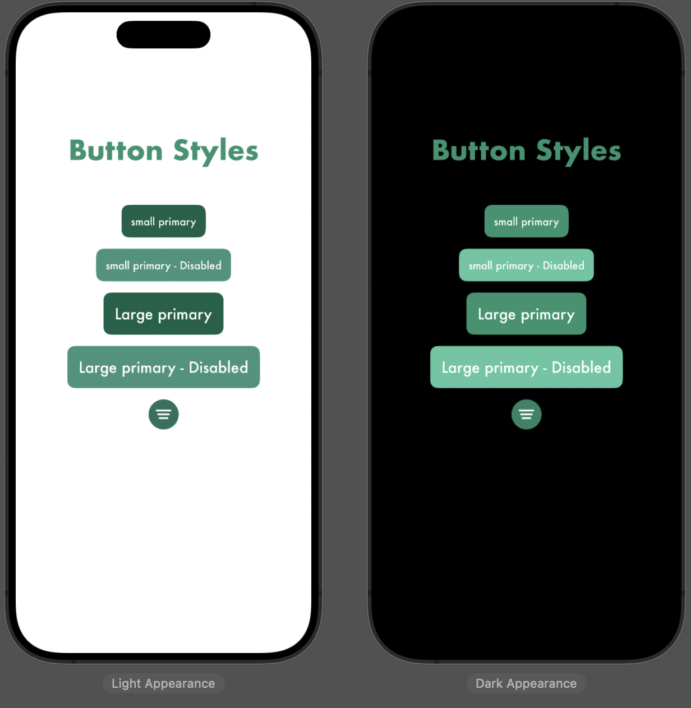

<h1 align="center" id="title">Flavor Flash</h1>

<pre id="description">
Flavor Flash is your go-to companion for making mealtime decisions effortlessly.

Record your delicious moments with our dual-camera photo-taking feature and easily share your "foodprint" with friends.</pre>

## What can you do on Flavor Flash?

- **Random Food Category Generator**: Let Flavor Flash decide your mealtime category and effortlessly search nearby restaurants for you.

- **Foodprint Sharing**: Capture your daily meals with your device's front and back camera simultaneously, creating a unique "foodprint." Share your culinary adventures with the community.

- **Community Interaction**: Explore and engage with your friends' foodprints by commenting and liking their posts.

- **Map Integration**: Browse your personal foodprint history on the map and discover your friends' foodprints by overlaying map annotations.

- **Friendship Made Easy**: Add friends seamlessly by scanning QR codes.

- **Foodie Chats**: Enjoy one-on-one conversations with your foodie friends.

- **Light/Dark Mode**: Toggle between light and dark modes for a personalized in-app experience.

- **Food Share Live Stream (Undeployed)**: Please note that the live stream functionality is currently undeployed due to potential App Store review concerns.

## Screen Shots

### LoginPage

### HomePage

<table>
  <tr align="center">
    <td>Landing Page</td>
     <td>Restaurant Map Search</td>
     <td>Restaurant Detail</td>
  </tr>
  <tr>
    <td></td>
    <td></td>
    <td></td>
  </tr>
    <tr>
    <td></td>
    <td></td>
    <td></td>
  </tr>
 </table>

### Flavor Flash Page

<table>
  <tr align="center">
    <td>Photo stream previewing</td>
     <td>Photo editing</td>
     <td>Submit page</td>
  </tr>
  <tr>
    <td></td>
    <td></td>
    <td></td>
  </tr>
    <tr>
    <td></td>
    <td></td>
    <td></td>
  </tr>
 </table>

### Foodprint Community

<table>
  <tr align="center">
    <td>Landing Page</td>
     <td>Comment sheet</td>
     <td>ChatRoom</td>
  </tr>
  <tr>
    <td></td>
    <td></td>
    <td></td>
  </tr>
    <tr>
    <td></td>
    <td></td>
    <td></td>
  </tr>
 </table>

### Profile

<table>
  <tr align="center">
    <td>Landing Page</td>
     <td>User foodprints map display</td>
     <td>Friend foodprint map annotation overlay</td>
  </tr>
  <tr align="center">
    <td></td>
    <td></td>
    <td></td>
  </tr>
    <tr align="center">
    <td></td>
    <td></td>
    <td></td>
  </tr>
 </table>

### Style Guide

## Project Architecture

## Feature Implementation Overview

- Developed with SwiftUI and following the MVVM architecture combined with Combine for enhanced flexibility and maintainability.

- Created custom UI components with a focus on flexibility, incorporating a comprehensive style guide through ViewModifiers to ensure a unified and flexible app interface.

- Effectively managed concurrent code by leveraging Swift's new language features, including encapsulating SDK completionHandler closures within asynchronous functions.

- Integrated UIKit components(UIView / UIViewController) into SwiftUI views.

- Implemented simultaneous capturing and previewing both food and facial images using the user’s front and back cameras. Utilized AVFoundation's API for efficient manipulation of the device camera.

- Analyzed food images by categorizing food images using CoreML + Vision, with a self-trained model created with CreateML for enhanced accuracy and customization.

- Utilized Google Places API to retrieve nearby restaurant data and then rendered geographic data via MapKit.

- Implemented real-time chat functionality by actively observing Cloud Firestore collection.

- (Undeployed) Foodie live streaming utilizing [WebRTC](https://github.com/stasel/WebRTC), implemented by designing a signaling client for observing Firestore collection.

## Tech Stack

- [SwiftUI](https://developer.apple.com/documentation/swiftui/) - A modern framework to declare user interfaces for any Apple platform.
- [Combine](https://developer.apple.com/documentation/combine) - Provides a declarative Swift API for processing values over time.
- [AVFoundation](https://github.com/unocss/unocss) - Work with audiovisual assets, control device cameras, process audio, and configure system audio interactions.

- [MapKit](https://developer.apple.com/documentation/mapkit) - Display map or satellite imagery within your app, call out points of interest, and determine placemark information for map coordinates.
- [CoreML](https://developer.apple.com/documentation/coreml) - Integrate machine learning models into apple platform apps.
- [Vision](https://developer.apple.com/documentation/vision) - Apply computer vision algorithms to perform a variety of tasks on input images and video.
- [WebRTC](https://github.com/stasel/WebRTC) - WebRTC Binaries for iOS and macOS.
- [SwiftLint](https://github.com/realm/SwiftLint) - Xcode source code linting tool.
