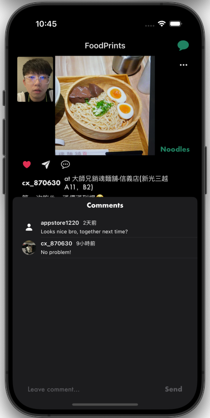

<h1 align="center" id="title">NumNum</h1>

Numnum is an app that foodie can record and share everyday meals in the "Food Prints" community. Join NumNum to share and explore restaurants with your friends!

## Main Features

- Generate random food category, and recommend nearby restaurants
- Dual Camera photo previewing / capturing
- CoreML Models trained by
- Share your everyday meal with close friends via our Foodprint Community
- Browse your foodprint on map, and checkout friend's foodprint by overlaying map annotations
- 1 on 1 Chat
- QRCode add friend
- Light / Dark mode toggle

## Screen Shots

### LoginPage

### HomePage

### Flavor Flash Page

### Foodprint Community

### Profile

## Tech Stack

**FrameWork:**

**Database:**

**CI / CD:**

## Project Structure
